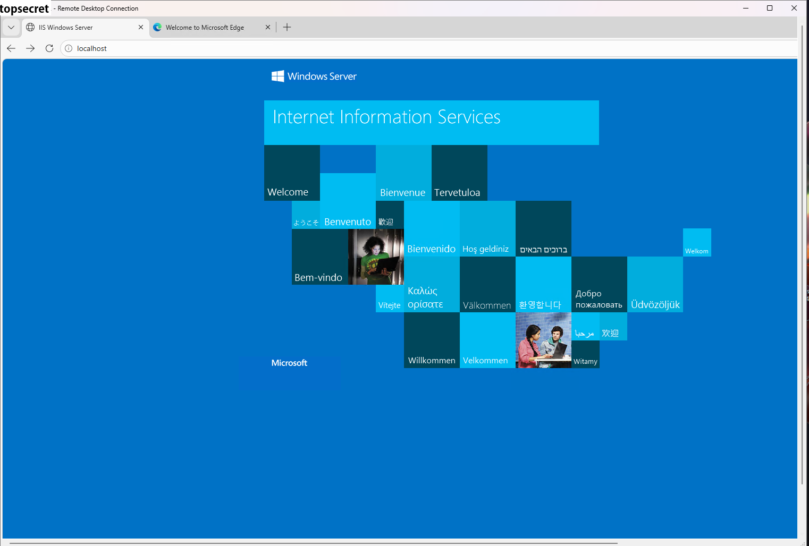
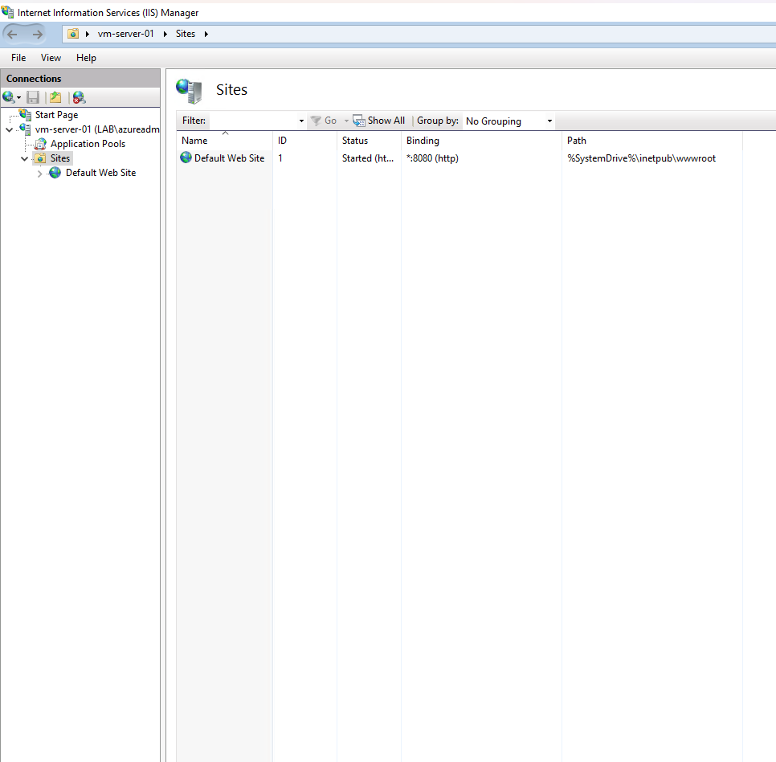
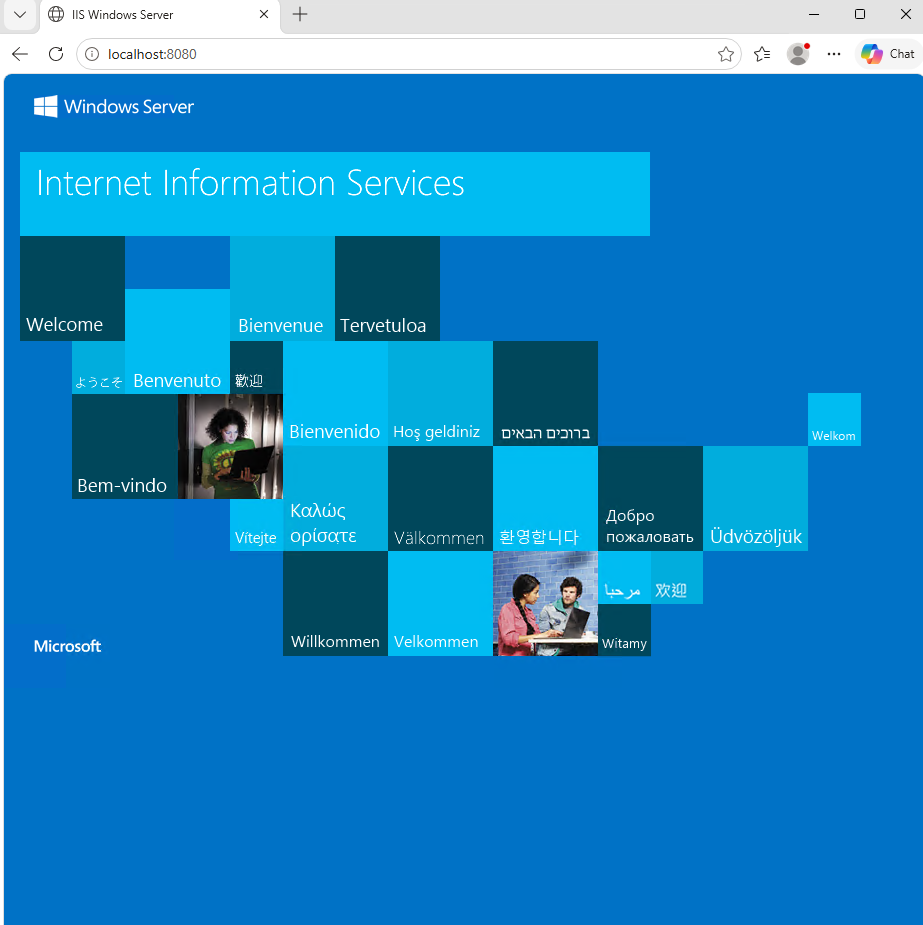
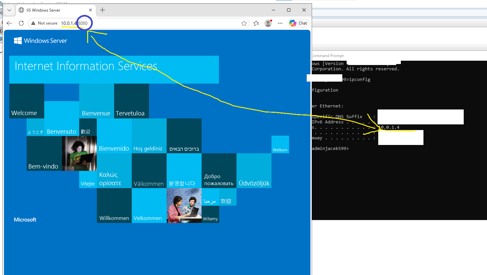
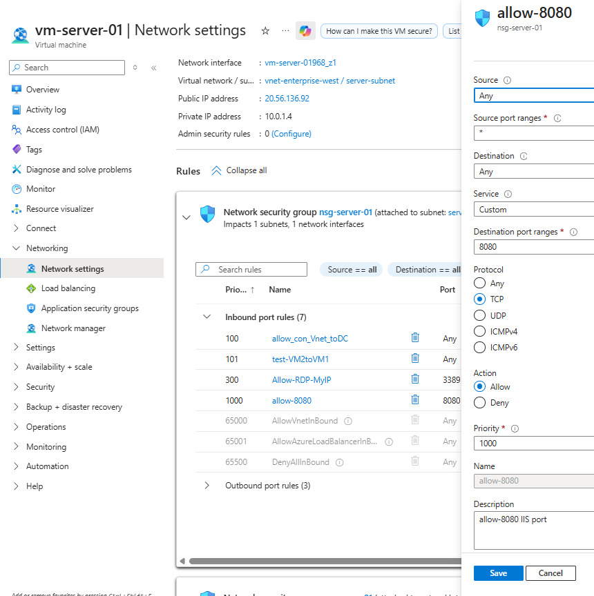
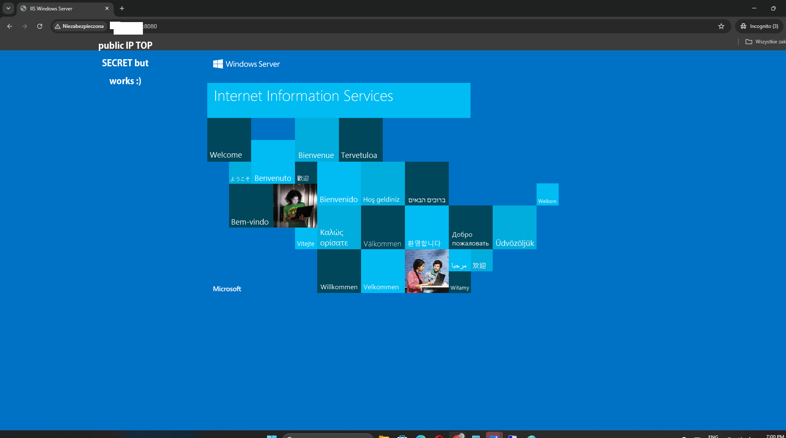

# Azure IIS Web Server Lab

## Project Overview

This project demonstrates the deployment and configuration of a Windows Server 2022 web server in Microsoft Azure using Internet Information Services (IIS).
The lab focuses on hosting a web application, configuring a custom HTTP port, and implementing secure network access using Azure Network Security Groups (NSGs) and Windows Firewall.

The goal of this project is to simulate a basic enterprise web server environment with layered security and external accessibility.

---

## Technologies Used

* Microsoft Azure
* Windows Server 2022
* Internet Information Services (IIS)
* Azure Virtual Network (VNet)
* Network Security Groups (NSG)
* Windows Firewall
* HTTP (Port 8080)

---

## Project Architecture

* Single Azure Virtual Machine (Windows Server 2022)
* IIS web server installed and configured
* Custom HTTP service running on port 8080
* Network-level security via NSG
* OS-level security via Windows Firewall
* External access via public IP address

---

## Implementation Steps

### 1. IIS Installation

Installed Internet Information Services (IIS) on Windows Server 2022 to enable web hosting capabilities.

---

### 2. Custom Port Configuration (8080)

Configured IIS to listen on a custom HTTP port (8080) using site bindings.

---

### 3. Local Testing

Validated web server functionality using:

* http://localhost:8080

---

### 4. VM Network Testing

Verified internal network access using:

* http://<VM_PRIVATE_IP>:8080

---

### 5. Security Configuration

Implemented layered security:

* Azure NSG inbound rule allowing TCP port 8080
* Windows Firewall inbound rule allowing TCP port 8080

---

### 6. External Access Validation

Confirmed successful external access to the web application using the VM public IP address.

---

## Key Security Concepts Demonstrated

* Network segmentation using NSG
* Least privilege access control
* Port-based firewall configuration
* Layered security (cloud + OS level)
* Controlled public exposure of services

---

## Screenshots

### 1. IIS Installation

### 2. IIS Binding Configuration (Port 8080)

### 3. Localhost Test

### 4. VM Internal IP Access

### 5. NSG and Firewall Configuration

### 6. External Access Verification

---

## Skills Demonstrated

* Azure Virtual Machine administration
* Web server deployment (IIS)
* Network configuration and troubleshooting
* Azure NSG management
* Windows Firewall configuration
* Secure application exposure
* Cloud networking fundamentals

---

## Summary

This lab demonstrates a complete workflow of deploying and securing a web server in Azure, including configuration, testing, and external accessibility validation under secure networking conditions.
